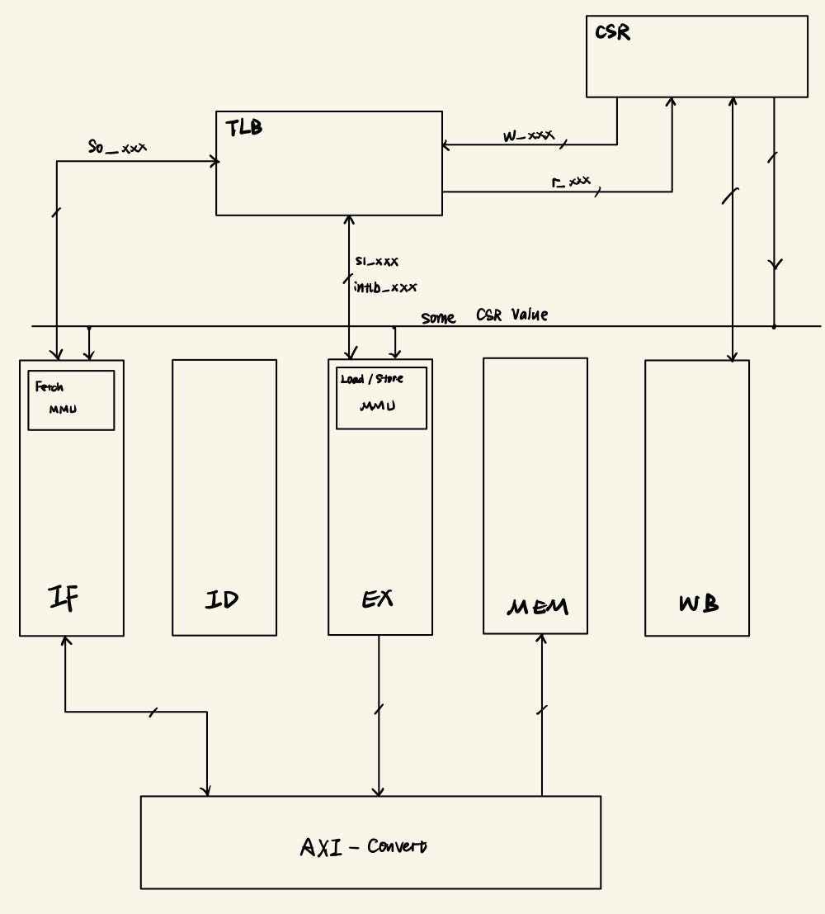

### EXP12 

* 异常使用ebus[15:0]沿着流水级传递，异常使用独热码表示

  后续要添加异常时可以参考以下代码:

  ```verilog
  assign has_sys = inst_syscall;
  assign ebus_end = ebus_init | {{15-`EBUS_SYS{1'b0}}, has_sys, {`EBUS_SYS{1'b0}}};
  ```

  最后在写回级再选出优先级最高的那个异常

* 异常或者ertn发生时，采用reset的方式清空流水线，同时保证一些动作不发生（如除法器）

* 关于时间的csr寄存器暂时注释掉了，从讲义cv的，不保证正确性(

### EXP13

- 异常和中断信号通过ebus_end传递，目前只有在IF、ID、EX阶段会产生例外。
- 关于中断：所有在csr模块中的中断代码都没有改动过，只是使用了has_int来查看中断信号，不保证能够正确采集到中断

### EXP14
* 涉及preIF和IF中指令取消的部分我的评价是依托答辩，具体细节在IF.v中的注释写了挺多了
* 在DHD中增加逻辑，当WB级通知需要处理ex或者ertn时，不允许发出阻塞信号
* 在divider中增加逻辑，当WB级通知需要处理ex或者ertn时，状态机立即切换并发出done信号

### EXP18
* 目前规划图：  
